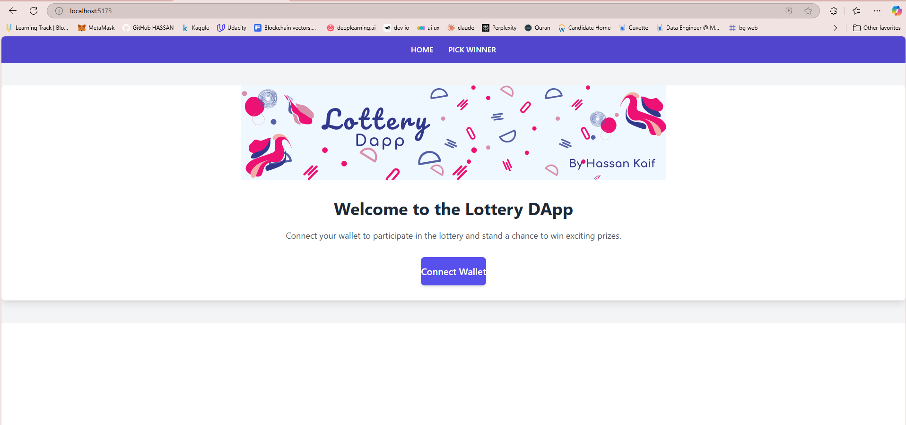
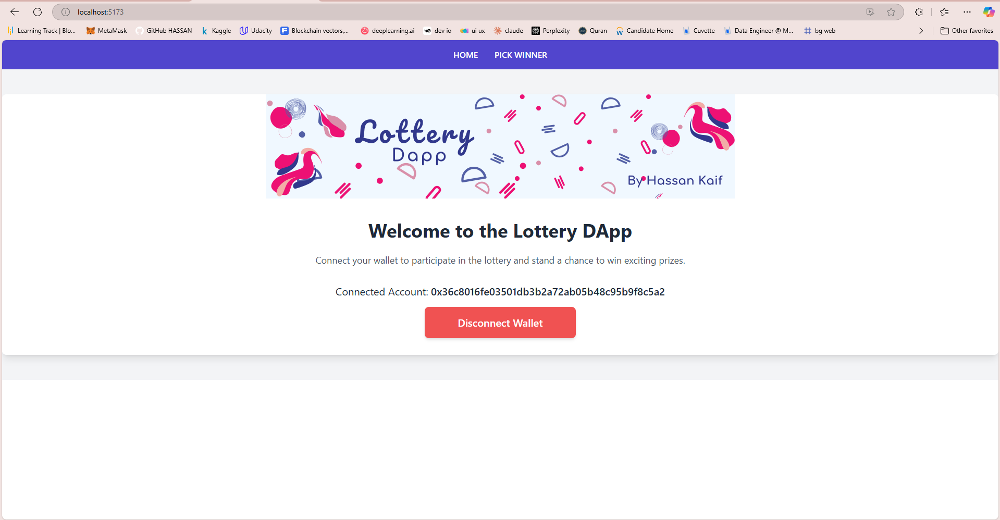
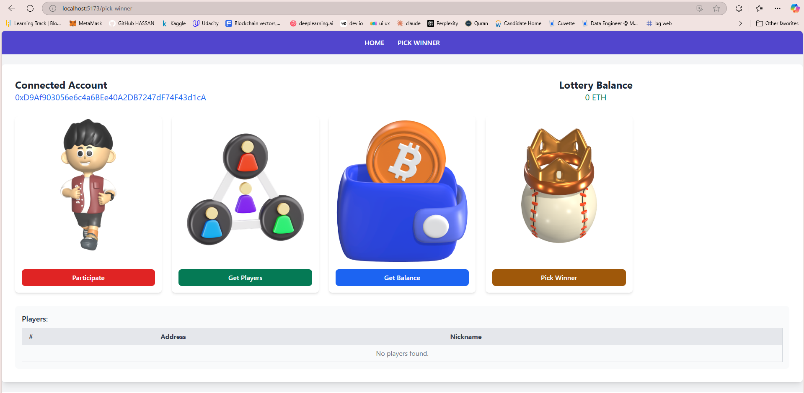
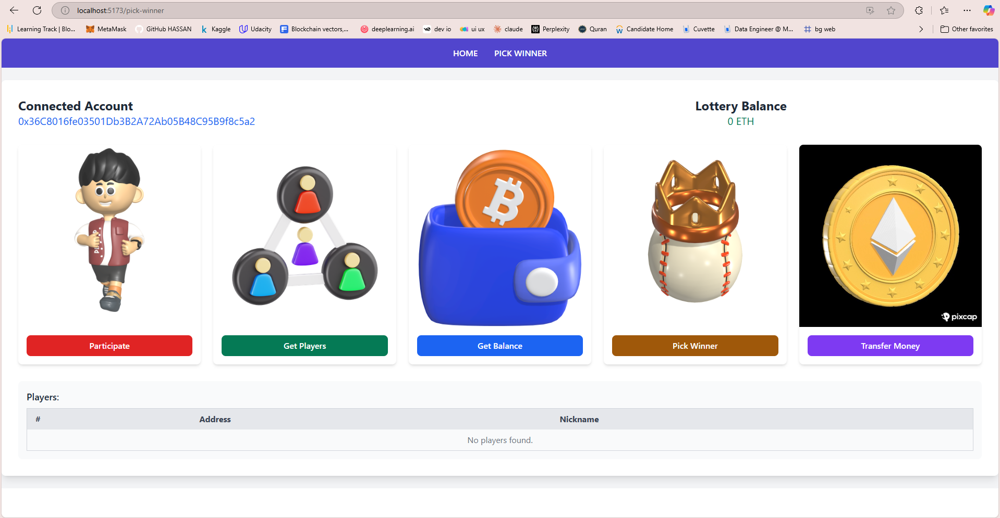

# 🎲 Lottery DApp


A decentralized application (DApp) built on Ethereum for conducting lotteries. Participants contribute **1 Ether** to join, and only the **manager** can pick a winner and transfer the prize.

---

## 🌟 Features

- 🧮 **Random Winner Selection**: Utilizes `keccak` and `block.difficulty` for fairness.
- 🏦 **Manage Participation**: Allow users to join the lottery with 1 Ether.
- 🛡️ **Manager Privileges**: Only the contract deployer can pick a winner and transfer the prize.
- 🔐 **MetaMask Integration**: Connect wallets for seamless interaction.
- 💻 **Local Blockchain Deployment**: Runs on Ganache for development.
- 🖌️ **Modern UI**: Built with React, Vite, and Flowbite.

---

## 🛠️ How It Works

1. Participants join the lottery by sending **1 Ether** to the contract.
2. The **manager** (contract deployer) picks a random winner using `keccak` and blockchain difficulty.
3. The manager transfers the total prize pool to the winner’s account.

---

## 🔧 Prerequisites

- **Ganache**: Local Ethereum blockchain to deploy the contract.
- **MetaMask**: Wallet to connect and interact with the DApp.
- **Node.js**: To install dependencies and run the project.
- **Truffle**: For smart contract compilation and migration.

---

## 🛠️ How to Run

### Step 1: Clone the Repository

```bash
git clone <repository-url>
cd <repository-folder>
```

### Step 2: Open Ganache

Start Ganache and configure it to match the truffle-config.js.
Copy the RPC server address and network ID to your MetaMask wallet.

### Step 3: Compile and Deploy the Contract

```bash
truffle compile
truffle migrate
```

### Step 4: Connect MetaMask

Add the local blockchain to MetaMask.
Import accounts from Ganache to MetaMask.

### Step 5: Run the Frontend

```bash
npm install
npm run dev
```

### Step 6: Use the DApp

The deployer acts as the manager.
Use 3-5 other accounts to participate.
The manager picks the winner and transfers the prize using the provided functionality.

### 📚 Tech Stack

- **Frontend**: React, Vite, Flowbite
- **Smart Contract**: Solidity
- **Blockchain**: Ganache (local Ethereum blockchain)
- **Wallet**: MetaMask
- **Deployment**: Truffle
- **Design Assets**: Canva (images, GIFs, and 3D icons)

## 🎨 Screenshots

### Home Page



### Pick Winner Page (For Manager)


### Pick Winner Page (For Participants)


### 🤝 Contributing

We welcome contributions! If you'd like to improve this project, feel free to fork the repository, open issues, or submit pull requests.

### 📜 License

This project is licensed under the MIT License. See the LICENSE file for details.

### 🚀 Future Enhancements

- Add email or SMS notifications for winners.
- Implement a live lottery tracker on the frontend.
- Deploy on a public testnet like Rinkeby or Goerli.

### 🌐 Connect with Me
[LinkedIn Profile](https://www.linkedin.com/in/hassan-kaif-a03028257/)

### 📺 Watch the Demo
[](https://youtu.be/YnXSqPTI8Y0)
